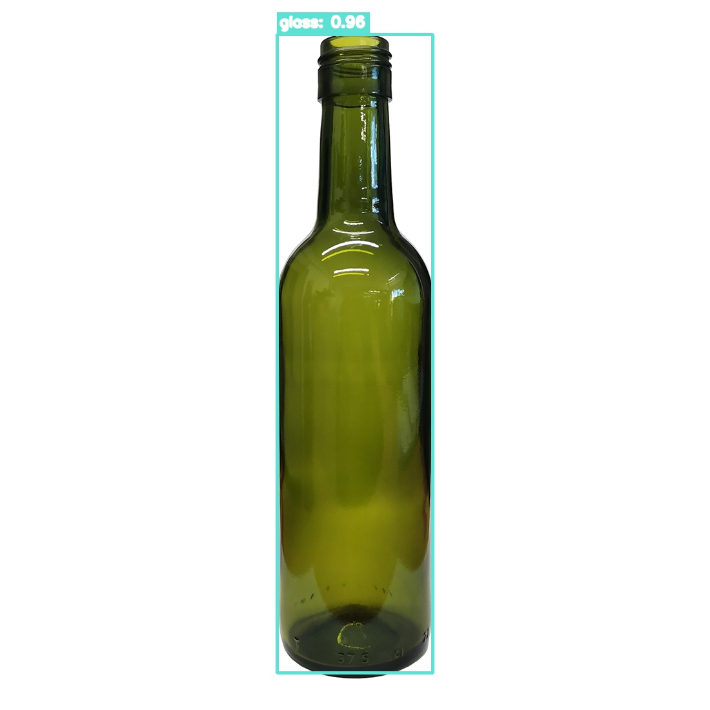

# Avance4Vision

Link drive: https://drive.google.com/drive/folders/1TBHwC4PUtKlpluFOc-XsAkeIfi1apqzP?usp=sharing

# ReciclaVision Chile

Este proyecto corresponde al Avance 4 del Taller de Introducción a Visión por Computadora. El objetivo fue probar el modelo entrenado en el Avance 3 con imágenes nuevas y revisar cómo responde frente a distintos tipos de residuos.

El modelo trabaja con cuatro clases:

- `glass`
- `metal`
- `paper`
- `plastic`

## Archivos del proyecto

Las imágenes originales también quedaron guardadas en Google Drive y se entregó acceso a esa carpeta. De todas formas, subí al repositorio todos los archivos necesarios para revisar el trabajo sin depender del enlace de Drive.

Dentro del repositorio se encuentran:

- el notebook ejecutado
- el modelo `best.pt`
- las nueve imágenes utilizadas en la prueba
- las imágenes con las detecciones dibujadas
- el archivo README

## Librerías principales

Se utilizaron las siguientes librerías:

- Ultralytics, para cargar el modelo y ejecutar la inferencia;
- OpenCV, para leer las imágenes y dibujar las cajas, etiquetas y confianzas;
- NumPy, para trabajar con los datos de las imágenes;
- Pandas, para organizar los resultados;
- Matplotlib, para mostrar las imágenes dentro del notebook.

## Cómo ejecutar el notebook

1. Abrir `ReciclaVision_Avance4_Final.ipynb` en Google Colab.
2. Montar Google Drive.
3. Verificar que el modelo esté ubicado en:

```text
/content/drive/MyDrive/ReciclaVision/modelos/best.pt
```

4. Verificar que las imágenes estén dentro de:

```text
/content/drive/MyDrive/ReciclaVision/avance4/datos_nuevos/
```

5. Ejecutar todas las celdas en orden.

## Pipeline de inferencia

Ultralytics se utiliza para obtener las predicciones del modelo. Después, las coordenadas, clases y niveles de confianza se extraen desde los resultados.

Las cajas y etiquetas se dibujan con OpenCV mediante:

```python
cv2.rectangle()
cv2.putText()
```

De esta forma, la visualización de las detecciones queda implementada directamente con OpenCV.

## Resultados

El análisis completo de cada imagen, junto con los aciertos, errores y mejoras propuestas, se encuentra escrito dentro del notebook.

Imagen de ejemplo

